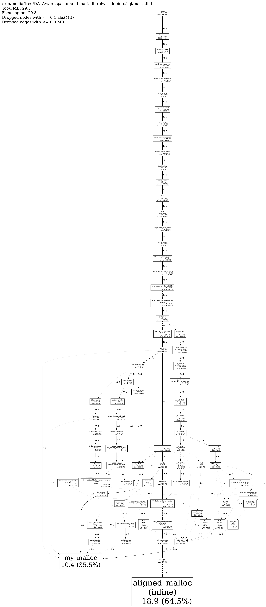
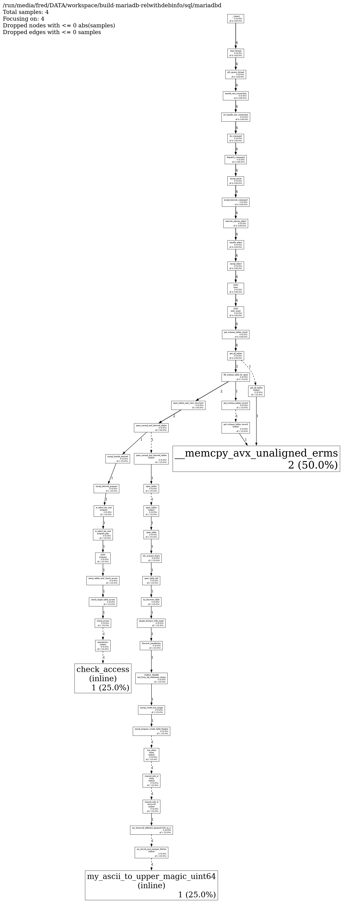

# mariadb-plugin-tcmalloc-profiler


MariaDB function plugin for memory & CPU profiling with gperftools/tcmalloc.

When MariaDB is started with the full tcmalloc profiler library, the plugin can
start, dump, and stop heap profiling or CPU profiling from SQL. It uses `pprof` to generate text
or dot reports from heap dump files.

## Requirements

- MariaDB built with plugin support.
- gperftools full tcmalloc profiler library, for example:
  `/usr/lib64/libtcmalloc_and_profiler.so`
- `pprof`, defaulting to `/usr/bin/pprof`.

The server must be started with tcmalloc preloaded:

```sh
LD_PRELOAD=/usr/lib64/libtcmalloc_and_profiler.so mariadbd
```

## Installation

Build the plugin with MariaDB, then load it:

```sql
INSTALL SONAME 'tcmalloc_profiler.so';
```

Verify the plugin and functions:

```sql
SELECT plugin_name, plugin_type, plugin_library, plugin_description,
       plugin_author
FROM information_schema.PLUGINS
WHERE plugin_name LIKE 'tcmalloc%';
```

Expected functions:

```text 
+---------------------------+-------------+----------------------+---------------------------------------------------------+---------------+
| plugin_name               | plugin_type | plugin_library       | plugin_description                                      | plugin_author |
+---------------------------+-------------+----------------------+---------------------------------------------------------+---------------+
| tcmalloc_profiler         | FUNCTION    | tcmalloc_profiler.so | TCMalloc Profiler plugin for MariaDB (system variables) | lefred        |
| tcmalloc_memprof_start    | FUNCTION    | tcmalloc_profiler.so | Function TCMALLOC_MEMPROF_START()                       | lefred        |
| tcmalloc_memprof_stop     | FUNCTION    | tcmalloc_profiler.so | Function TCMALLOC_MEMPROF_STOP()                        | lefred        |
| tcmalloc_memprof_dump     | FUNCTION    | tcmalloc_profiler.so | Function TCMALLOC_MEMPROF_DUMP()                        | lefred        |
| tcmalloc_memprof_report   | FUNCTION    | tcmalloc_profiler.so | Function TCMALLOC_MEMPROF_REPORT()                      | lefred        |
| tcmalloc_memprof_diff     | FUNCTION    | tcmalloc_profiler.so | Function TCMALLOC_MEMPROF_DIFF()                        | lefred        |
| tcmalloc_cpuprof_start    | FUNCTION    | tcmalloc_profiler.so | Function TCMALLOC_CPUPROF_START()                       | lefred        |
| tcmalloc_cpuprof_stop     | FUNCTION    | tcmalloc_profiler.so | Function TCMALLOC_CPUPROF_STOP()                        | lefred        |
| tcmalloc_cpuprof_flush    | FUNCTION    | tcmalloc_profiler.so | Function TCMALLOC_CPUPROF_FLUSH()                       | lefred        |
| tcmalloc_cpuprof_report   | FUNCTION    | tcmalloc_profiler.so | Function TCMALLOC_CPUPROF_REPORT()                      | lefred        |
| tcmalloc_profiler_cleanup | FUNCTION    | tcmalloc_profiler.so | Function TCMALLOC_PROFILER_CLEANUP()                    | lefred        |
+---------------------------+-------------+----------------------+---------------------------------------------------------+---------------+
```


## SQL Usage

Check the active allocator:

```sql
SELECT TCMALLOC_PROFILER();
```

Start heap profiling:

```sql
SELECT TCMALLOC_MEMPROF_START();
```

Start heap profiling for a specified period of time (in seconds):

```sql
SELECT TCMALLOC_MEMPROF_START(60);
```

Request an extra heap dump while profiling is running:

```sql
SELECT TCMALLOC_MEMPROF_DUMP();
```

Stop heap profiling:

```sql
SELECT TCMALLOC_MEMPROF_STOP();
```

Start CPU profiling:

```sql
SELECT TCMALLOC_CPUPROF_START();
```

Start CPU profiling for a specified period of time (in seconds):

```sql
SELECT TCMALLOC_CPUPROF_START(60);
```

Request a CPU profile flush while profiling is running:

```sql
SELECT TCMALLOC_CPUPROF_FLUSH();
```

Stop CPU profiling:

```sql
SELECT TCMALLOC_CPUPROF_STOP();
```

### Reporting

Generate a report from the dump files:

```sql
SELECT TCMALLOC_MEMPROF_REPORT();
SELECT TCMALLOC_MEMPROF_REPORT('/tmp/memprof_dump.*.heap', 20, 'TEXT');
```

Generate a CPU profile report:

```sql
SELECT TCMALLOC_CPUPROF_REPORT();
SELECT TCMALLOC_CPUPROF_REPORT('/tmp/cpuprof', 20);
SELECT TCMALLOC_CPUPROF_REPORT('DOT') INTO DUMPFILE 'cpu.dot';
```

Examples:

```sql 
SELECT TCMALLOC_MEMPROF_REPORT()\G
```

The output will be similar to:

```text
*************************** 1. row ***************************
TCMALLOC_MEMPROF_REPORT(): Total: 29.3 MB
    18.9  64.5%  64.5%     18.9  64.5% aligned_malloc (inline)
    10.4  35.5% 100.0%     10.4  35.5% my_malloc
     0.0   0.0% 100.0%      0.0   0.0% my_realloc
     0.0   0.0% 100.0%     18.9  64.5% PFS_buffer_scalable_container::allocate
     0.0   0.0% 100.0%      0.0   0.1% sp_cache_insert
     0.0   0.0% 100.0%      0.0   0.1% ha_tina::ha_tina
     0.0   0.0% 100.0%      0.0   0.0% Binary_string::alloc (inline)
     0.0   0.0% 100.0%      0.0   0.0% Binary_string::copy
     0.0   0.0% 100.0%      0.0   0.0% Binary_string::real_alloc
     0.0   0.0% 100.0%      0.4   1.5% Column_definition_attributes::make_field
     0.0   0.0% 100.0%      0.0   0.0% Create_qfunc::create_func
     0.0   0.0% 100.0%      0.0   0.0% Create_sp_func::create_with_db
     0.0   0.0% 100.0%      0.0   0.1% Create_tmp_table::finalize
     0.0   0.0% 100.0%      0.0   0.2% Dynamic_array::Dynamic_array (inline)
     0.0   0.0% 100.0%      0.0   0.2% Dynamic_array::init (inline)
     0.0   0.0% 100.0%      0.1   0.4% Eq_creator::create
     0.0   0.0% 100.0%      0.4   1.5% Field::clone
     0.0   0.0% 100.0%      0.4   1.5% Field::operator new (inline)
     0.0   0.0% 100.0%      0.0   0.1% Hash_set::insert (inline)
     0.0   0.0% 100.0%      0.2   0.6% Item::operator new (inline)
     0.0   0.0% 100.0%     29.3 100.0% JOIN::exec
     0.0   0.0% 100.0%     29.3 100.0% JOIN::exec_inner
     0.0   0.0% 100.0%      0.0   0.0% JOIN::optimize
     0.0   0.0% 100.0%      0.0   0.0% JOIN::optimize_inner
     0.0   0.0% 100.0%      0.0   0.0% LEX::make_item_func_call_generic@2b2ef0
     0.0   0.0% 100.0%      0.0   0.0% LEX::make_item_func_call_generic@2b2fc0
     0.0   0.0% 100.0%      0.0   0.0% LEX::make_item_func_call_generic@2b4470
     0.0   0.0% 100.0%      0.0   0.0% LEX::make_item_func_or_method_call
     0.0   0.0% 100.0%      0.1   0.2% LEX::make_sp_head
     0.0   0.0% 100.0%      0.0   0.1% LEX::sp_block_init
     0.0   0.0% 100.0%      0.0   0.1% LEX::sp_block_init (inline)
     0.0   0.0% 100.0%      0.0   0.1% LEX::sp_body_finalize_function
     0.0   0.0% 100.0%      0.0   0.1% LEX::sp_body_finalize_routine
     0.0   0.0% 100.0%      0.0   0.1% LEX::sp_body_finalize_routine (inline)
     0.0   0.0% 100.0%      0.2   0.7% LEX::sp_variable_declarations_init
     0.0   0.0% 100.0%      0.0   0.1% LEX::stmt_create_stored_function_start
     0.0   0.0% 100.0%      0.2   0.6% Lex_input_stream::body_utf8_start
     0.0   0.0% 100.0%      0.0   0.1% Lex_input_stream::get_text
     0.0   0.0% 100.0%      0.0   0.1% Lex_input_stream::lex_one_token
     0.0   0.0% 100.0%      0.0   0.1% Lex_input_stream::lex_token
     0.0   0.0% 100.0%      0.0   0.1% Lex_input_stream::lex_token (inline)
     0.0   0.0% 100.0%      0.2   0.5% MDL_context::acquire_lock
     0.0   0.0% 100.0%      0.0   0.0% MDL_context::release_lock
     0.0   0.0% 100.0%      0.0   0.0% MDL_context::release_locks_stored_before
     0.0   0.0% 100.0%      0.2   0.5% MDL_context::try_acquire_lock_impl
     0.0   0.0% 100.0%      0.0   0.0% MDL_lock::release (inline)
     0.0   0.0% 100.0%      0.2   0.5% MDL_map::try_acquire_lock
     0.0   0.0% 100.0%      0.2   0.5% MDL_map::try_acquire_lock (inline)
     0.0   0.0% 100.0%      2.1   7.1% MYSQLparse
     0.0   0.0% 100.0%     18.9  64.5% PFS_buffer_default_allocator::alloc_array (inline)
     0.0   0.0% 100.0%      0.3   0.9% PFS_partitioned_buffer_scalable_container::allocate (inline)
     0.0   0.0% 100.0%      0.0   0.0% Protocol::net_store_data_cs
     0.0   0.0% 100.0%      0.0   0.0% Protocol::send_result_set_row
     0.0   0.0% 100.0%      0.4   1.3% Query_arena::alloc (inline)
     0.0   0.0% 100.0%      0.0   0.1% Query_arena::strmake_lex_cstring (inline)
     0.0   0.0% 100.0%      0.0   0.1% Query_arena::strmake_lex_cstring_trim_whitespace (inline)
     0.0   0.0% 100.0%      0.0   0.1% Query_arena::strmake_lex_string (inline)
     0.0   0.0% 100.0%      0.0   0.0% Sp_handler::add_used_routine
     0.0   0.0% 100.0%      3.0  10.2% Sp_handler::db_find_and_cache_routine
     0.0   0.0% 100.0%      0.0   0.1% Sp_handler::db_find_and_cache_routine (inline)
     0.0   0.0% 100.0%      3.0  10.1% Sp_handler::db_find_routine
     0.0   0.0% 100.0%      3.0  10.1% Sp_handler::db_load_routine
     0.0   0.0% 100.0%      3.0  10.2% Sp_handler::sp_cache_routine
     0.0   0.0% 100.0%      0.0   0.0% Sp_handler::sp_cache_routine_reentrant
     0.0   0.0% 100.0%      1.5   5.3% Sql_alloc::operator new (inline)
     0.0   0.0% 100.0%      0.0   0.0% Sql_path::operator=
     0.0   0.0% 100.0%      0.0   0.0% Sql_path::resolve
     0.0   0.0% 100.0%      0.0   0.0% Sql_path::set
     0.0   0.0% 100.0%      0.0   0.0% Sql_path::try_resolve_in_schema
     0.0   0.0% 100.0%      3.0  10.2% Sroutine_hash_entry::sp_cache_routine
     0.0   0.0% 100.0%      0.0   0.0% String::copy
     0.0   0.0% 100.0%      0.0   0.0% String::copy (inline)
     0.0   0.0% 100.0%      0.0   0.0% TABLE::init
     0.0   0.0% 100.0%      0.0   0.0% TABLE_LIST::prepare_security
     0.0   0.0% 100.0%      0.7   2.5% TABLE_SHARE::init_from_binary_frm_image
     0.0   0.0% 100.0%      0.6   2.2% TABLE_SHARE::init_from_sql_statement_string
     0.0   0.0% 100.0%      0.0   0.0% THD::commit_whole_transaction_and_close_tables
     0.0   0.0% 100.0%      0.0   0.2% THD::restore_from_local_lex_to_old_lex
     0.0   0.0% 100.0%      0.0   0.0% THD::set_db
     0.0   0.0% 100.0%      0.0   0.1% THD::strmake_lex_cstring_trim_whitespace (inline)
     0.0   0.0% 100.0%      0.1   0.5% Table_triggers_list::check_n_load
     0.0   0.0% 100.0%      0.0   0.0% Table_triggers_list::check_n_load (inline)
     0.0   0.0% 100.0%      0.0   0.1% Transparent_file::Transparent_file
     0.0   0.0% 100.0%      0.0   0.1% Type_handler_blob_common::make_table_field_from_def
     0.0   0.0% 100.0%      0.1   0.2% Type_handler_enum::make_table_field_from_def
     0.0   0.0% 100.0%      0.3   1.0% Type_handler_longlong::make_table_field_from_def
     0.0   0.0% 100.0%      0.0   0.0% Type_handler_string::make_table_field_from_def
     0.0   0.0% 100.0%      0.0   0.2% Type_handler_varchar::make_table_field_from_def
     0.0   0.0% 100.0%     26.3  90.0% __clone3
     0.0   0.0% 100.0%      0.0   0.0% _ma_alloc_buffer
     0.0   0.0% 100.0%      0.0   0.1% _ma_alloc_buffer (inline)
     0.0   0.0% 100.0%      0.3   0.9% _ma_bitmap_init
     0.0   0.0% 100.0%      0.0   0.1% _ma_init_block_record
     0.0   0.0% 100.0%      0.3   0.9% _ma_once_init_block_record
     0.0   0.0% 100.0%      0.0   0.0% _ma_open_datafile
     0.0   0.0% 100.0%      0.0   0.0% acl_get
     0.0   0.0% 100.0%      0.0   0.0% acl_get_all3
     0.0   0.0% 100.0%      0.0   0.0% acl_get_all3 (inline)
     0.0   0.0% 100.0%      0.1   0.2% alloc_dynamic
     0.0   0.0% 100.0%      3.5  11.9% alloc_root
     0.0   0.0% 100.0%      3.0  10.4% alloc_table_share
     0.0   0.0% 100.0%      0.0   0.0% check_db_dir_existence [clone .part.0]
     0.0   0.0% 100.0%      0.0   0.0% close_thread_table
     0.0   0.0% 100.0%      0.0   0.0% close_thread_tables
     0.0   0.0% 100.0%      0.0   0.1% create_cond
     0.0   0.0% 100.0%      0.0   0.0% create_internal_tmp_table
     0.0   0.0% 100.0%      0.0   0.0% create_internal_tmp_table_from_heap
     0.0   0.0% 100.0%      0.3   0.9% create_mutex
     0.0   0.0% 100.0%      0.0   0.1% create_schema_table
     0.0   0.0% 100.0%     17.7  60.5% create_table
     0.0   0.0% 100.0%      0.0   0.1% create_tmp_table_for_schema
     0.0   0.0% 100.0%      0.0   0.0% dbname_cache_t::insert (inline)
     0.0   0.0% 100.0%      0.6   2.2% discover_handlerton
     0.0   0.0% 100.0%     29.3 100.0% dispatch_command
     0.0   0.0% 100.0%      0.0   0.0% dispatch_command (inline)
     0.0   0.0% 100.0%     29.3 100.0% do_command
     0.0   0.0% 100.0%     29.2  99.8% do_handle_one_connection
     0.0   0.0% 100.0%     29.3 100.0% execute_sqlcom_select
     0.0   0.0% 100.0%      0.0   0.0% fill_effective_table_privileges
     0.0   0.0% 100.0%     29.3 100.0% fill_schema_table_by_open
     0.0   0.0% 100.0%      0.0   0.0% find_or_create_digest
     0.0   0.0% 100.0%      0.0   0.1% find_or_create_file
     0.0   0.0% 100.0%      0.9   3.2% find_or_create_program
     0.0   0.0% 100.0%      0.1   0.2% find_or_create_program (inline)
     0.0   0.0% 100.0%      0.0   0.1% find_or_create_table_share
     0.0   0.0% 100.0%     29.3 100.0% get_all_tables
     0.0   0.0% 100.0%      0.2   0.7% get_new_handler
     0.0   0.0% 100.0%      0.0   0.0% get_schema_tables_record
     0.0   0.0% 100.0%     29.3 100.0% get_schema_tables_result
     0.0   0.0% 100.0%      0.0   0.0% get_share [clone .isra.0]
     0.0   0.0% 100.0%      0.0   0.0% get_share [clone .isra.0] (inline)
     0.0   0.0% 100.0%      0.6   2.2% ha_discover_table
     0.0   0.0% 100.0%      1.1   3.6% ha_maria::open
     0.0   0.0% 100.0%      0.0   0.1% ha_myisam::open
     0.0   0.0% 100.0%      0.0   0.0% ha_tina::open
     0.0   0.0% 100.0%      0.0   0.0% ha_tina::open (inline)
     0.0   0.0% 100.0%     29.1  99.5% handle_one_connection
     0.0   0.0% 100.0%     29.3 100.0% handle_select
     0.0   0.0% 100.0%     18.8  64.2% handler::ha_open
     0.0   0.0% 100.0%      4.9  16.8% init_alloc_root
     0.0   0.0% 100.0%      0.1   0.4% init_dynamic_array2
     0.0   0.0% 100.0%      0.0   0.1% init_lex_with_single_table
     0.0   0.0% 100.0%      4.9  16.8% init_sql_alloc
     0.0   0.0% 100.0%      0.0   0.1% initialize_bucket
     0.0   0.0% 100.0%      0.0   0.1% inline_mysql_cond_init (inline)
     0.0   0.0% 100.0%      0.0   0.0% inline_mysql_end_statement (inline)
     0.0   0.0% 100.0%      0.0   0.0% inline_mysql_file_create_with_symlink (inline)
     0.0   0.0% 100.0%      0.0   0.1% inline_mysql_file_open (inline)
     0.0   0.0% 100.0%      0.0   0.0% insert_dynamic
     0.0   0.0% 100.0%      0.0   0.0% instantiate_tmp_table
     0.0   0.0% 100.0%      0.0   0.0% is_package_public_routine
     0.0   0.0% 100.0%      0.3   0.9% lf_alloc_constructor
     0.0   0.0% 100.0%      0.3   0.9% lf_alloc_constructor (inline)
     0.0   0.0% 100.0%      0.7   2.5% lf_alloc_new
     0.0   0.0% 100.0%      0.1   0.2% lf_dynarray_lvalue
     0.0   0.0% 100.0%      0.0   0.0% lf_hash_delete
     0.0   0.0% 100.0%      0.7   2.5% lf_hash_insert
     0.0   0.0% 100.0%      0.0   0.2% lf_hash_search_using_hash_value
     0.0   0.0% 100.0%      0.1   0.2% lf_pinbox_get_pins
     0.0   0.0% 100.0%      0.0   0.0% lookup_setup_object
     0.0   0.0% 100.0%      0.7   2.3% maria_clone_internal (inline)
     0.0   0.0% 100.0%      0.0   0.0% maria_create
     0.0   0.0% 100.0%      0.0   0.0% maria_create_handler
     0.0   0.0% 100.0%      1.1   3.6% maria_open
     0.0   0.0% 100.0%      0.0   0.0% maria_reset
     0.0   0.0% 100.0%      0.4   1.5% memdup_root
     0.0   0.0% 100.0%      0.0   0.0% mi_alloc_rec_buff
     0.0   0.0% 100.0%      0.0   0.1% mi_open
     0.0   0.0% 100.0%      0.0   0.0% mi_open_datafile
     0.0   0.0% 100.0%      0.0   0.2% multi_alloc_root
     0.0   0.0% 100.0%      0.1   0.2% my_hash_insert
     0.0   0.0% 100.0%      0.0   0.0% my_memdup
     0.0   0.0% 100.0%      0.7   2.4% my_multi_malloc
     0.0   0.0% 100.0%      0.0   0.0% my_register_filename
     0.0   0.0% 100.0%      0.0   0.0% my_strdup
     0.0   0.0% 100.0%      0.0   0.0% my_strndup
     0.0   0.0% 100.0%      0.0   0.0% mysql_change_db
     0.0   0.0% 100.0%      0.0   0.0% mysql_change_db (inline)
     0.0   0.0% 100.0%     29.3 100.0% mysql_execute_command
     0.0   0.0% 100.0%      0.0   0.0% mysql_make_view
     0.0   0.0% 100.0%      0.0   0.0% mysql_opt_change_db
     0.0   0.0% 100.0%     29.3 100.0% mysql_parse
     0.0   0.0% 100.0%      0.0   0.1% mysql_schema_table
     0.0   0.0% 100.0%     29.3 100.0% mysql_select
     0.0   0.0% 100.0%      0.0   0.0% open_and_lock_tables
     0.0   0.0% 100.0%      0.0   0.0% open_and_lock_tables (inline)
     0.0   0.0% 100.0%      0.0   0.0% open_and_process_routine (inline)
     0.0   0.0% 100.0%     26.2  89.7% open_and_process_table (inline)
     0.0   0.0% 100.0%     29.3 100.0% open_normal_and_derived_tables
     0.0   0.0% 100.0%     29.3 100.0% open_normal_and_derived_tables (inline)
     0.0   0.0% 100.0%      0.0   0.0% open_proc_table_for_read
     0.0   0.0% 100.0%      0.0   0.0% open_system_tables_for_read
     0.0   0.0% 100.0%     26.2  89.7% open_table
     0.0   0.0% 100.0%      0.8   2.9% open_table_def
     0.0   0.0% 100.0%      0.1   0.5% open_table_entry_fini
     0.0   0.0% 100.0%     21.2  72.6% open_table_from_share
     0.0   0.0% 100.0%      0.1   0.5% open_table_get_mdl_lock
     0.0   0.0% 100.0%     29.3 100.0% open_tables
     0.0   0.0% 100.0%      3.0  10.3% open_tables (inline)
     0.0   0.0% 100.0%     29.3 100.0% open_tables_only_view_structure
     0.0   0.0% 100.0%      0.0   0.1% open_tmp_table
     0.0   0.0% 100.0%      0.0   0.0% optimize_schema_tables_memory_usage
     0.0   0.0% 100.0%      2.1   7.1% parse_sql
     0.0   0.0% 100.0%      0.0   0.1% parse_vcol_defs
     0.0   0.0% 100.0%      0.1   0.2% pfs_create_handler
     0.0   0.0% 100.0%      0.0   0.1% pfs_end_file_open_wait_and_bind_to_descriptor_v1
     0.0   0.0% 100.0%      0.0   0.0% pfs_end_statement_v1
     0.0   0.0% 100.0%      0.0   0.0% pfs_end_statement_v1 (inline)
     0.0   0.0% 100.0%     18.9  64.5% pfs_malloc
     0.0   0.0% 100.0%     18.9  64.5% pfs_malloc_array
     0.0   0.0% 100.0%     29.0  99.2% pfs_spawn_thread
     0.0   0.0% 100.0%      0.6   2.2% plugin_foreach_with_mask
     0.0   0.0% 100.0%      0.0   0.0% schema_table_store_record
     0.0   0.0% 100.0%      0.0   0.0% select_result_sink::send_data_with_check
     0.0   0.0% 100.0%      0.0   0.0% select_send::send_data
     0.0   0.0% 100.0%      0.0   0.0% sp_add_used_routine
     0.0   0.0% 100.0%      0.0   0.1% sp_cache::insert (inline)
     0.0   0.0% 100.0%      3.0  10.1% sp_compile
     0.0   0.0% 100.0%      0.0   0.1% sp_create_assignment_instr
     0.0   0.0% 100.0%      0.4   1.3% sp_create_assignment_lex
     0.0   0.0% 100.0%      0.0   0.0% sp_head::add_instr
     0.0   0.0% 100.0%      0.0   0.0% sp_head::add_instr_freturn
     0.0   0.0% 100.0%      0.1   0.2% sp_head::create
     0.0   0.0% 100.0%      0.9   3.2% sp_head::init_psi_share
     0.0   0.0% 100.0%      0.9   3.2% sp_head::init_psi_share (inline)
     0.0   0.0% 100.0%      0.0   0.2% sp_head::merge_lex
     0.0   0.0% 100.0%      0.0   0.1% sp_head::merge_table_list
     0.0   0.0% 100.0%      0.4   1.5% sp_head::reset_lex
     0.0   0.0% 100.0%      0.0   0.1% sp_head::restore_lex (inline)
     0.0   0.0% 100.0%      0.0   0.1% sp_head::set_c_chistics
     0.0   0.0% 100.0%      0.0   0.1% sp_head::set_chistics
     0.0   0.0% 100.0%      0.0   0.1% sp_head::set_stmt_end
     0.0   0.0% 100.0%      0.0   0.1% sp_head::sp_head
     0.0   0.0% 100.0%      0.0   0.1% sp_pcontext::push_context
     0.0   0.0% 100.0%      0.0   0.2% sp_pcontext::sp_pcontext
     0.0   0.0% 100.0%      0.0   0.0% sp_type_def_list::sp_type_def_list
     0.0   0.0% 100.0%      0.0   0.1% sp_update_sp_used_routines
     0.0   0.0% 100.0%      0.1   0.3% sql_parse_prepare
     0.0   0.0% 100.0%      0.2   0.6% st_select_lex::add_table_to_list
     0.0   0.0% 100.0%     28.3  96.8% start_thread
     0.0   0.0% 100.0%      0.1   0.2% strmake_root
     0.0   0.0% 100.0%      4.5  15.3% tdc_acquire_share
     0.0   0.0% 100.0%      0.1   0.4% tina_create_handler
     0.0   0.0% 100.0%      0.0   0.1% unpack_vcol_info_from_frm

1 row in set (9.516 sec)
```

```sql 
SELECT TCMALLOC_CPUPROF_REPORT()\G
```

The output will be similar to:

```text
*************************** 1. row ***************************
TCMALLOC_CPUPROF_REPORT(): Total: 4 samples
       2  50.0%  50.0%        2  50.0% __memcpy_avx_unaligned_erms
       1  25.0%  75.0%        1  25.0% check_access (inline)
       1  25.0% 100.0%        1  25.0% my_ascii_to_upper_magic_uint64 (inline)
       0   0.0% 100.0%        4 100.0% JOIN::exec
       0   0.0% 100.0%        4 100.0% JOIN::exec_inner
       0   0.0% 100.0%        1  25.0% JOIN::prepare
       0   0.0% 100.0%        1  25.0% Lex_ident::streq (inline)
       0   0.0% 100.0%        1  25.0% TABLE_SHARE::init_from_sql_statement_string
       0   0.0% 100.0%        4 100.0% __clone3
       0   0.0% 100.0%        1  25.0% charset_info_st::streq (inline)
       0   0.0% 100.0%        1  25.0% charset_info_st::strnncoll (inline)
       0   0.0% 100.0%        1  25.0% check_access
       0   0.0% 100.0%        1  25.0% check_single_table_access
       0   0.0% 100.0%        1  25.0% discover_handlerton
       0   0.0% 100.0%        4 100.0% dispatch_command
       0   0.0% 100.0%        4 100.0% do_command
       0   0.0% 100.0%        4 100.0% do_handle_one_connection
       0   0.0% 100.0%        4 100.0% execute_sqlcom_select
       0   0.0% 100.0%        3  75.0% fill_schema_table_by_open
       0   0.0% 100.0%        4 100.0% get_all_tables
       0   0.0% 100.0%        1  25.0% get_all_tables (inline)
       0   0.0% 100.0%        1  25.0% get_schema_tables_record
       0   0.0% 100.0%        1  25.0% get_schema_tables_record (inline)
       0   0.0% 100.0%        4 100.0% get_schema_tables_result
       0   0.0% 100.0%        1  25.0% ha_discover_table
       0   0.0% 100.0%        4 100.0% handle_one_connection
       0   0.0% 100.0%        4 100.0% handle_select
       0   0.0% 100.0%        1  25.0% my_strcoll_ascii_toupper_8bytes (inline)
       0   0.0% 100.0%        1  25.0% my_strnncoll_utf8mb3_general1400_as_ci
       0   0.0% 100.0%        1  25.0% mysql_create_frm_image
       0   0.0% 100.0%        1  25.0% mysql_derived_prepare
       0   0.0% 100.0%        4 100.0% mysql_execute_command
       0   0.0% 100.0%        1  25.0% mysql_handle_derived
       0   0.0% 100.0%        4 100.0% mysql_parse
       0   0.0% 100.0%        1  25.0% mysql_prepare_create_table_finalize
       0   0.0% 100.0%        4 100.0% mysql_select
       0   0.0% 100.0%        2  50.0% open_normal_and_derived_tables
       0   0.0% 100.0%        1  25.0% open_normal_and_derived_tables (inline)
       0   0.0% 100.0%        1  25.0% open_table
       0   0.0% 100.0%        1  25.0% open_table_def
       0   0.0% 100.0%        1  25.0% open_tables
       0   0.0% 100.0%        1  25.0% open_tables (inline)
       0   0.0% 100.0%        2  50.0% open_tables_only_view_structure
       0   0.0% 100.0%        1  25.0% operator&= (inline)
       0   0.0% 100.0%        4 100.0% pfs_spawn_thread
       0   0.0% 100.0%        1  25.0% plugin_foreach_with_mask
       0   0.0% 100.0%        1  25.0% setup_tables_and_check_access
       0   0.0% 100.0%        1  25.0% st_select_lex_unit::prepare
       0   0.0% 100.0%        1  25.0% st_select_lex_unit::prepare_join
       0   0.0% 100.0%        4 100.0% start_thread
       0   0.0% 100.0%        1  25.0% tdc_acquire_share

1 row in set (9.179 sec)
```

It's also possible to only display to top n lines: 

```sql
SELECT TCMALLOC_MEMPROF_REPORT("TEXT",10)\G
```

The first 10 lines are displayed:

```text
*************************** 1. row ***************************
TCMALLOC_MEMPROF_REPORT("TEXT",10): Total: 29.3 MB
    18.9  64.5%  64.5%     18.9  64.5% aligned_malloc (inline)
    10.4  35.5% 100.0%     10.4  35.5% my_malloc
     0.0   0.0% 100.0%      0.0   0.0% my_realloc
     0.0   0.0% 100.0%     18.9  64.5% PFS_buffer_scalable_container::allocate
     0.0   0.0% 100.0%      0.0   0.1% sp_cache_insert
     0.0   0.0% 100.0%      0.0   0.1% ha_tina::ha_tina
     0.0   0.0% 100.0%      0.0   0.0% Binary_string::alloc (inline)
     0.0   0.0% 100.0%      0.0   0.0% Binary_string::copy
     0.0   0.0% 100.0%      0.0   0.0% Binary_string::real_alloc

1 row in set (11.692 sec)
```

```sql
SELECT TCMALLOC_CPUPROF_REPORT("TEXT",10)\G
```

The first 10 lines are displayed:

```text
*************************** 1. row ***************************
TCMALLOC_CPUPROF_REPORT("TEXT",10): Total: 4 samples
       2  50.0%  50.0%        2  50.0% __memcpy_avx_unaligned_erms
       1  25.0%  75.0%        1  25.0% check_access (inline)
       1  25.0% 100.0%        1  25.0% my_ascii_to_upper_magic_uint64 (inline)
       0   0.0% 100.0%        4 100.0% JOIN::exec
       0   0.0% 100.0%        4 100.0% JOIN::exec_inner
       0   0.0% 100.0%        1  25.0% JOIN::prepare
       0   0.0% 100.0%        1  25.0% Lex_ident::streq (inline)
       0   0.0% 100.0%        1  25.0% TABLE_SHARE::init_from_sql_statement_string
       0   0.0% 100.0%        4 100.0% __clone3

1 row in set (8.571 sec)
```


Generate a dot report and convert it to PNG:

```sql
SELECT TCMALLOC_MEMPROF_REPORT('dot') INTO DUMPFILE 'memory.dot';

SELECT TCMALLOC_CPUPROF_REPORT('dot') INTO DUMPFILE 'cpu.dot';
```

```sh
dot -Tpng memory.dot -o memory.png
dot -Tpng cpu.dot -o cpu.png
```

Use `DUMPFILE`, not `OUTFILE`, for DOT output. `OUTFILE` escapes characters in
the result string and can produce an invalid dot file.

Example:

Memory:



CPU:




Generate a diff report for memory:

```sql
SELECT TCMALLOC_MEMPROF_DIFF();
SELECT TCMALLOC_MEMPROF_DIFF('/tmp/memprof_dump.0001.heap',
                             '/tmp/memprof_dump.*.heap',
                             20,
                             'TEXT');
```

You can cleanup the generated dumps:

```SQL
SELECT TCMALLOC_PROFILER_CLEANUP();
```

The cleanup function removes heap dump files matching
`tcmalloc_profiler_dump_path` and the CPU profile file configured by
`tcmalloc_profiler_cpu_profile_path`. It refuses to remove files while either
profiler is running.

## Variables and Status

```sql
SHOW GLOBAL VARIABLES LIKE 'tcmalloc_profiler_%';
SHOW GLOBAL STATUS LIKE 'tcmalloc_profiler_%';
```

Variables:

- `tcmalloc_profiler_cpu_profile_path`: CPU profile output path. Default:
  `/tmp/cpuprof`.
- `tcmalloc_profiler_dump_path`: dump file prefix. Default:
  `/tmp/memprof_dump`.
- `tcmalloc_profiler_pprof_binary`: path to `pprof`. Default:
  `/usr/bin/pprof`.


```text
+------------------------------------+-------------------+
| Variable_name                      | Value             |
+------------------------------------+-------------------+
| tcmalloc_profiler_cpu_profile_path | /tmp/cpuprof      |
| tcmalloc_profiler_dump_path        | /tmp/memprof_dump |
| tcmalloc_profiler_pprof_binary     | /usr/bin/pprof    |
+------------------------------------+-------------------+
```

Status:

- `Tcmalloc_profiler_cpu_status`: `ON` when CPU profiling is running,
  otherwise `OFF`.
- `Tcmalloc_profiler_memory_status`: `ON` when heap profiling is running,
  otherwise `OFF`.

```text
+---------------------------------+-------+
| Variable_name                   | Value |
+---------------------------------+-------+
| Tcmalloc_profiler_cpu_status    | ON    |
| Tcmalloc_profiler_memory_status | OFF   |
+---------------------------------+-------+
```

## MTR Test

The MTR suite is in `mysql-test/tcmalloc_profiler`.

It loads the plugin with:

```text
--plugin-load-add=$TCMALLOC_PROFILER_SO
```

and preloads tcmalloc from:

```text
LD_PRELOAD=/usr/lib64/libtcmalloc_and_profiler.so
```

Run it from a MariaDB build tree:

```sh
./mtr --tmpdir=/tmp/mtrtmp tcmalloc_profiler
```

The test checks plugin variables/status, allocator detection, heap profiler
start/dump/stop/reporting, CPU profiler start/flush/stop/reporting, and
cleanup of generated profiling files.
